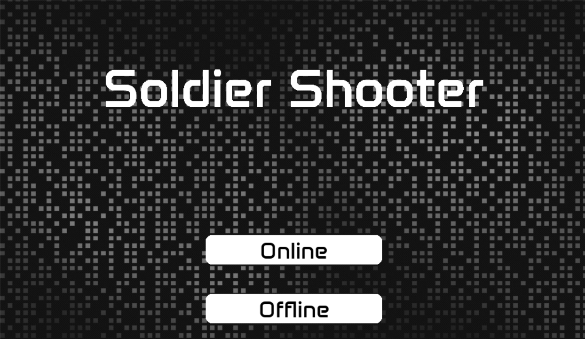
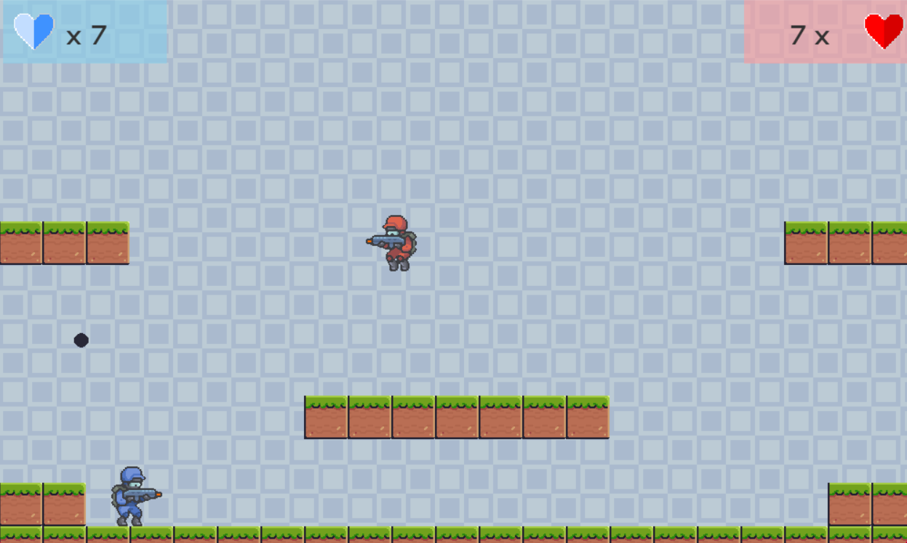

# Description
Solder Shooter is a two-player fighting game, in which the main task of the players is to control their characters to shoot down the opponent's target character, bringing joy to everyone
## Features
The game features 2 playing modes: 
- Online Mode: Two players will play on separate devices. 
- Offline Mode: Two players play on the same device.
  
Additional features will be available in the future!
## Author
- [Dieter Walker](https://github.com/DieterWalker)
- [Nam Blue](https://github.com/nam050402)
## ScreenShot
- Main Menu screen

- In game screen

- Result Screen

## Dowloading project
```bash
$ git clone https://github.com/DieterWalker/PyGame_Shooter.git
$ cd Pygame_Shooter
```

## Installation Python3 and Pygame
Update packetlist

```bash
Sudo apt update
```

Upgrade new version

```bash
Sudo apt -y upgrade
```

Dowload Python3

```bash
Sudo apt install python3
```

Dowload python3-pip

```bash
Sudo apt install python3-pip
```

Dowload pygame

```bash
pip install pygame
```

## Setup port 

Check port

```bash
Sudo ufw status verbose
```


```bash
Sudo ufw enable
```
